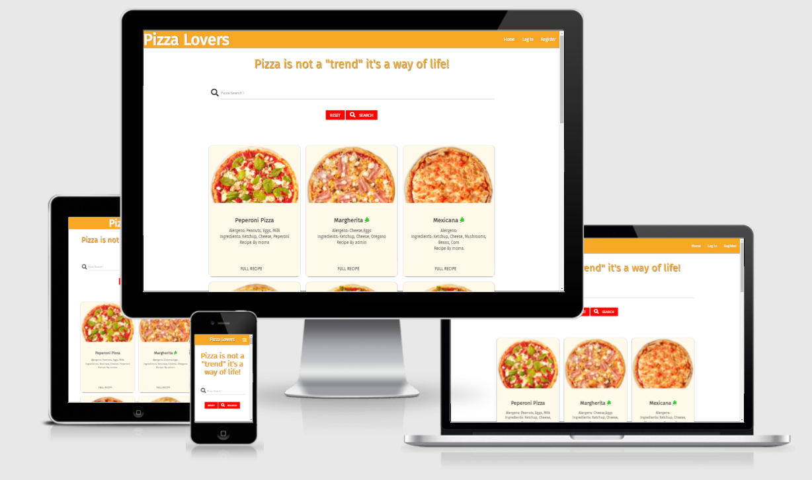
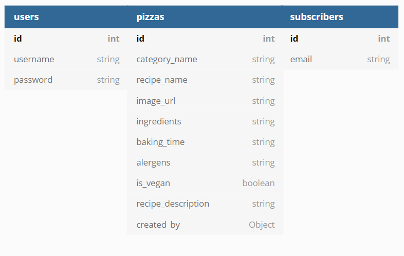
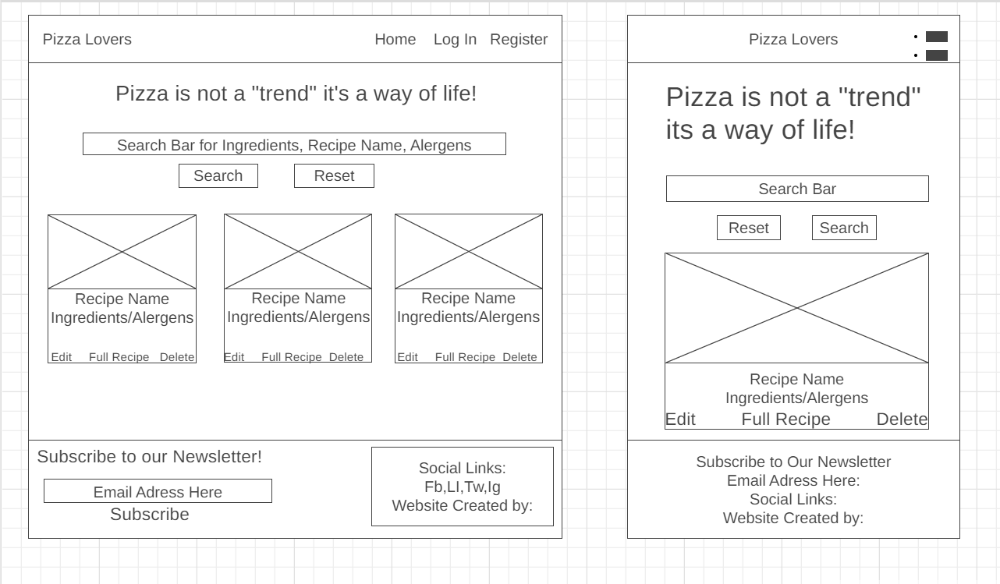
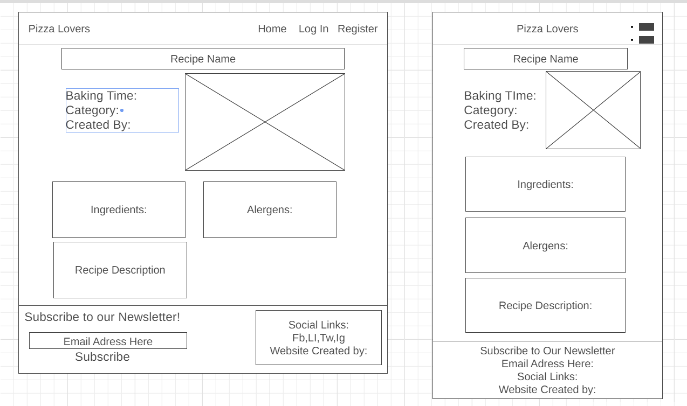

<h1 align="center">Pizza Lovers</h1>

[View Live Site Here](http://pizza-lovers-moma.herokuapp.com/get_pizzas)

## Table of Contents

> - [UX](#ux)
> - [User Stories](#user-stories)
> - [Design](#design)
> - [Data Schema](#data-schema)
> - [Wireframes](#wireframes)
> - [Features](#features)
> - [Existing Features](#existing-features)
> - [Technologies Used](#technologies-used)
> - [Testing](#testing)
> - [Deployment](#deployment)
> - [Credits](#credits)
> - [Resources](#resources)
> - [Acknowledgments](#acknowledgments)

## UX

### Project Goals

The primary goal of **Pizza Lovers** is to allow the users to create, save, search, and view their favorite pizza recipes in one place using  HTML5, CSS3, JavaScript, Python, Flask, and MongoDB.

### User Goals
The user is looking for a web-based application where they can:
- Use the CRUD conventions to:
    - Create a recipe
    - Read recipe
    - Update(Edit) recipe
    - Delete recipe they created
- Be able to search the database for recipes with keywords that query Recipe Names, Ingredients, and Alergens.

## User Stories
**As a first-time user, I want to be able to:**
- Visit the website on every device, so that I can look at the website on desktop, mobile, and tablet.
- Navigate easily through the website, so I can find everything easily. 
- See an overview of all recipes, so I can get inspired by all recipes.
- Search for recipes based on words, so I can find recipes easily.
- Register for an account on the website, so I can share my recipes with other Pizza Lovers.
- Sign up for the newsletter. 

**As a Site Member /Returning User, I want to be able to:**
- Add my recipes, so I can share my recipes with everyone else.
- Edit my recipes, so I can update information in the recipe.
- Delete my recipes, so I can remove the recipe when it is no longer relevant. 
- Log in to my profile, so I have access to my recipes. 
- Logout from my profile, so I can log in to a different profile. 

**As an Admin user of the site, I want to be able to:**
- Add new categories, so I can make the categories clear and manageable.
- Edit categories, so I can update categories. 
- Delete categories, so I can remove categories when they are no longer relevant. 

### Strategy

- For this project, the targeted audiences would be:
    - Pizza/Food Lovers
    - People who are passionate about cooking
    - People of all ages searching for information
    
- The website enables the user to:
    - Register an account
    - Log In to their account
    - View Recipes
    - Search Recipes, by recipe name, ingredients or alergens
    - Create their own recipes and upload them to the database
    - View the full recipe they have created, or that someone else has created
    - Edit recipes they  have created
    - Delete a recipe created by them
    - Subscribe to a Newsletter (Fictional)

### Scope

- What the user will look for in this web application:
    - Easy navigation
    - Welcoming Design
    - Searching the database for recipes
    - Adding their recipes
    - Managing recipes (Edit or Delete)
    - Viewing the Full Recipe
    - Able to Register and Login

[ back to top ](#table-of-contents)

## Design

### Colors

- Colors used for text and background:
    - #f9a825
    - #bb0000
    - Red
    - #fff
    - rgb(0, 185, 0)
    - #fff9ea

### Typography

- The primary font used is **Fira Sans**, and **Sans Serif** is used as a default backup font.

## Data Schema
[MongoDB](https://www.mongodb.com/) was used for this project and the schema design was created. See below:

- The Main Database is called Pizza, it has 4 other collections.
    - Categories - Where the Recipe Categories are stored.
    - Pizzas - Where we store the Recipe Name, Image URL, Ingredients, Baking Time, Alergens, Is Vegan, Recipe Description, and Created by.
    - Users - Where the users Username and Password (Hashed) are stored.
    - Subscribers - Where the users Email is stored.

[ back to top ](#table-of-contents)

### User Collection
- Upon registering, the user will be required to provide the following:
    - Username
    - Password

### Recipe Collection
- When creating a new recipe the user will provide the following:
    - Category Name (Required)
    - Recipe Name (Required)
    - Recipe Image URL (Required)
    - Ingredients (Required)
    - Alergens (Required)
    - Baking Time (Required)
    - Recipe Description (Not Required)

### Category Collection
- Currently, there are five categories the user can choose from:
    - American Pizza
    - Italian Pizza
    - Pan Pizza
    - Pizza Pie
    - Calzone

### Subscriber Collection
- If the user decides to subscribe to the newsletter he/she will have to provide:
    - Email Address (which is stored in the database)

### Wireframes

Wireframes for the homepage, left view is desktop and right view is mobile.

Wireframes for the Full Recipe page, left view is desktop and right view is mobile.

[ back to top ](#table-of-contents)

## Features

- Each page has a responsive and fixed-top navigation element, so the user can navigate to a different page at any moment.
- The **Footer** of the site contains social media links and a Newsletter subscription.

- If the user is logged in to their account, they will have access to:
    - Home Page
    - Profile page
    - New Recipe Page
    - Log Out Page
    - If the user is "admin", they will have access to Manage Categories, where they can add new categories or edit/delete currently active ones.
- The website uses _cards_ to display recipes, giving short info for the user:
    - Recipe Image
    - Recipe Name
    - Alergens
    - Ingredients
    - Recipe Created By
    - A button to view the full recipe
    - A Edit Button to edit the recipe if user is the creator of the recipe or is "admin"
    - A Delete BUtton to delete the recipe if user is the creator of the recipe or is "admin"
### Existing Features

- Home Page

    - Welcome Text inside the navigation element
    - A search bar where the user can search for recipes
    - Recipe cards

- Login 

    - Login page allows the user to:

        - Enter the username used when registered.

        - Use the password created when registered and [Werkzeug](https://werkzeug.palletsprojects.com/en/2.0.x/) will un-hash the password for user authentication.

        - Login button, submits the form when all fields are filled.

- Register

    - Registration Form allows the user to:
        
        - Enter their desired username
        - The password field uses [Werkzeug](https://werkzeug.palletsprojects.com/en/2.0.x/) to hash the password on entry.
        - Register button, to submit the form when all fields are filled correctly.

- Profile

    - Profile page allows the user to:

        - View the recipes created by them.
        - Use the **Add Recipe** button to create a new recipe.
        - Use the full recipe button to view the full recipe.

- New Recipe

    - New Recipe page allows the user to:

        - Fill the add recipe form by:

            - Choosing a category
            - Adding the recipe name
            - Adding the recipe image
            - Adding the ingredients
            - Adding the alergens
            - Adding the Baking Time
            - Adding the Recipe Description (Optional)
            - Toggling the Vegan switch (If the pizza is vegan or not)
        
        - Use the buttons to:

            - Cancel and go back.
            - Submit the form by clicking the **Add Recipe button**.
    
- Edit Recipe Button:

    - Allows the user to:

        - Change and edit each field of the form.
        - Submit the form and update the recipe.
        - Cancel and go back.

- Delete Recipe Button:

    - Allows the user to:

        - Delete the recipe they have created.
    
If the user is **"admin"**, he/she will have access to Manage Categories.

- Manage Categories:

    - Allows the "admin" user to:

        - View all categories
        - Add a new category
        - Edit all categories
        - Delete all categories

- Add Category Button:

    - Allows the "admin" user to:

        - Add a new category with a text form.
        - Submit the form by using the **Add Category** button.

### Features to implement in the future

- Manage Profile

    - Add a profile image
    - Edit username or password
    - Delete account

## Technologies Used
### Languages
- [HTML5](https://en.wikipedia.org/wiki/HTML5)
- [CSS3](https://en.wikipedia.org/wiki/CSS)
- [JavaScript](https://en.wikipedia.org/wiki/JavaScript)
- [Python](https://en.wikipedia.org/wiki/Python_(programming_language))

### Frameworks, Libraries & Programs Used
- [Materialize](https://materializecss.com/)
    - Materialize was used to build the website and make it responsive and stylish.
- [jQuery](https://jquery.com/)
    - jQuery was used to initialize [Materialize](https://materializecss.com/) and also for the site's functionality, as is Vanilla JS as well
- [Google Fonts](https://fonts.google.com/)
    - Google Fonts was used to import the **Fira Sans** font, which was used throughout the project.
- [Font Awesome](https://fontawesome.com/)
    - Font Awesome was used for all icons used in this project.
- [GitHub](https://github.com/)
    - GitHub is used to store the project's code after being pushed from Git.
- [Git](https://git-scm.com/)
    - Git was used for version control by utilizing the Gitpod terminal to commit to Git and Push to GitHub.
- [Gitpod](https://www.gitpod.io/docs/)
    - Used as the IDE for this project.
- [Am I Responsice](http://ami.responsivedesign.is/#)
    - Used to validate the responsiveness of the site.
- [Heroku](https://id.heroku.com/login)
     -  Heroku was used to deploy the website.
- [Flask](https://flask.palletsprojects.com/en/2.0.x/)
     - Flask was used as the web framework for the application.
- [PyMongo](https://pypi.org/project/pymongo/)
     - `flask_pymongo` was used to connect between the MongoDB database and Python.
- [BSON](https://bsonspec.org/)
     - `bson.objectid` is a required dependency for MongoDB.
- [Jinja](http://jinja.pocoo.org/docs/2.10/)
     - Jinja templating language was used to simplify and display backend data in HTML.
- [Werkzeug](https://werkzeug.palletsprojects.com/en/2.0.x/)
     - Werkzeug was used for password hashing and authentication.

[ back to top ](#table-of-contents)

## Testing

All Testing can be found here:
[All Testing](https://github.com/MomciloDordevic/MS3/blob/main/TESTING.md)

## Deployment

- Login in to [Heroku](https://id.heroku.com/login)
- Click on New, and Create a new app.
- Enter your app name.
- Select the region that is closest to you.
- Click on the Connect to GitHub section in the deploy tab in Heroku.
- Search your repository to connect with it.
- Then connect to your repository.
- Go to settings and click on Config Vars.
- Enter the variables in your env.py file.
    
        os.environ.setdefault("IP", "0.0.0.0")
        os.environ.setdefault("PORT", "8080")
        os.environ.setdefault("SECRET_KEY", "Generate a key for randomkeygen.com")
        os.environ.setdefault("MONGO_URI", "") --> Used to connect to our database
        os.environ.setdefault("MONGO_DBNAME", "Name of our database")

- Enable Automatic Deployment

    - Go to the deploy tab
    - In the automatic deploys section, choose the branch that you want to deploy from and select Enable Automatic Deploys.

## Credits

### Resources

- [Rebecca Tracey-Timoney](https://github.com/rebeccatraceyt/bake-it-til-you-make-it/blob/master/README.md#Credits)
- [juanstelling](https://github.com/juanstelling/MS3_breaktasty/blob/fe5b544beb648f153f69f362bf06b31bcc3e7b09/README.md#deployment)
- [TravelTimN](https://github.com/TravelTimN/flask-task-manager-project/tree/demo)
- [Stack Overflow](https://stackoverflow.com/) 
#### For genereal resources
- [mickmccann](https://github.com/mickmccann/MS3-Small-Jobs#contents)
- [Code Institute's Flask Task-Manager Mini Project](https://www.youtube.com/watch?v=y72Dq3GRxhc)
- [Materialize](https://materializecss.com/)

### Code

- [steff880](https://github.com/steff880/MS3-MyRecipeBook)
- [Rebecca Tracey-Timoney](https://github.com/rebeccatraceyt/bake-it-til-you-make-it/blob/master/README.md#Credits)
- [juanstelling](https://github.com/juanstelling/MS3_breaktasty/blob/fe5b544beb648f153f69f362bf06b31bcc3e7b09/README.md#deployment)
- [TravelTimN](https://github.com/TravelTimN/flask-task-manager-project/tree/demo)
- [DonnaIB](https://github.com/DonnaIB/surround_yourself_with_spanish/blob/master/app.py)
- [Code Institute's Flask Task-Manager Mini Project](https://www.youtube.com/watch?v=y72Dq3GRxhc)
- [Error Handlers](https://flask.palletsprojects.com/en/1.1.x/errorhandling/)

[ back to top ](#table-of-contents)

### Acknowledgments

-   My mentor, Adegbenga Adeye, for his guidance and feedback.
-   The team at Code Institute, for teaching me the necessary skills to create this site.
-   [Stackoverflow](https://stackoverflow.com/) - For tips and information.
-   Code Institute Tutor team.
-   [TravelTimN](https://github.com/Code-Institute-Solutions/TaskManagerAuth)
-   [steff880](https://github.com/steff880/MS3-MyRecipeBook)
-   [juanstelling](https://github.com/juanstelling/MS3_breaktasty)
-   [w3schools](https://www.w3schools.com/default.asp) for all the useful information found on the site.

## For the Assessors

**Please note, that due to being pressed by the time, new commitments, and two jobs, I was not able to add all the features and design I wanted to.** 

If you would like to login as an **"admin"**, please use this:

- Username: Admin
- Password: 1234

<h1>Disclaimer</h1>
This project is for educational purposes only. If there is an issue with the copyright or the content, please contact me @ qwertyumom@gmail.com

Thanks for visiting !

[ back to top ](#table-of-contents)

