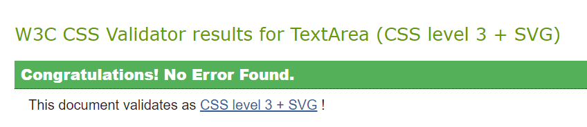
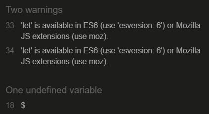
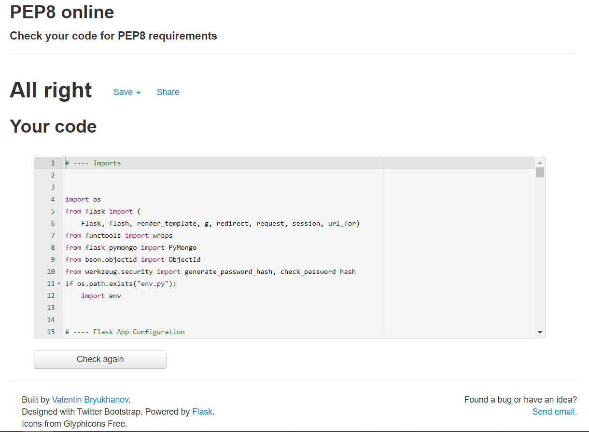

<h1 align="center">Testing</h1>

---

## Index 

- <a href="#validators">1. Code validators</a>
- <a href="#responsiveness">2. Responsiveness</a>
- <a href="#browser-compatibility">3. Browser compability</a>
- <a href="#user-stories">4. Testing user stories </a>
- <a href="#manual-testing">5. Manual Testing</a>
- <a href="#bugs">6. Bugs</a>

---

## 1. Code validators
 - **[HTML Validator](https://validator.w3.org/):** No errors to show.
    - With testing the HTML code, I had some syntax issues on all pages I build with jinja templating.
    - I tested the HTML code by running my server locally and used view page source. This code I passed through the validator.
    - There is one warning on every page saying: Section lacks heading. Consider using h2-h6 elements to add identifying heading to all sections. I have got this warning because I have put my flash messages between sections.

 - **[CSS Validator](https://jigsaw.w3.org/css-validator/):** No errors found.

    

 - **[JS Hint](https://jshint.com/):** No errors found, two warnings, one undefined variable 
    - 2 warnings consist the notification: 'let' is available in ES6 (use 'esversion: 6') or Mozilla JS extensions (use moz).
    - 1 undefined variable: $

    

 - **[Python validator | PEP8](http://pep8online.com/):** No errors found

    

## 2. Responsiveness 
- Responsiveness of the website is tested with [Chrome DevTools](https://developers.google.com/web/tools/chrome-devtools).
- The website is tested on the following devices: 
    - Desktop: 1024px, 1366px, 1440px, 1600px and 1680px. 
    - Mobile & Tablet: Galaxy S5, iPhone 5/SE, iPhone 6/7/8, iPhone 6/7/8 plus, iPhone x, iPad and  iPad Pro.

## 3. Browser compatibility 
- I have tested the website on Mozila, Chrome and Microsoft Edge while on a desktop.
- I have tested the website on Safari using a MacBook Pro.

## 4. Testing user stories 

### First-time user goals:
1. As a first time user, I want to be able to visit the website on every device, so that I can look at the website on desktop, mobile and tablet. 
    - The first time user can visite the website on a computer, laptop, tablet and phone.
2. As a first time user, I want to be able to navigate easily through the website, so I can find everything easily. 
    - The first time user can navigate through the website with the navbar. The navbar is on top of the website. For the mobile users there is a hamburger menu. The navbar displays all pages the user can visit. 
3. As a first time user, I want to see an overview of all recipes, so I can get inspired by all recipes.
    - The first time user can visit an overview of all recipes by clicking on Home. On this page there is an overview of all recipes made.
4. As a first time user, I want to be able to search recipes based on words, so I can find recipes easily. (For example, I can search the word Ham and all recipes with the ingredient Cheese, Cheese Alergens or Cheese in the recipe name will appear.)
    - On the recipes pages there is a searchbar, where first time users can search for words. The search is based on the title of the recipe or the ingredients. 
5. As a first time user, I want to register an account on the website, so I can share my recipes with other Pizza Lovers. 
    - The first time user can navigate to the register page by clicking on Login/Register CTA in the top navbar. If the first time user clicks on the CTA they have a choice to login of register. If the first time visistor clicks on register, they will navigate to the register form on the website. 
6. As a first time user, I want to sign up for the newsletter. 
    - The first time user can go to the footer to sign up for the newsletter. In the footer there is a input field where the first time user can fill in their email to signup.

### Site Member /Returning User goals
1. As a site member, I want to add my recipes, so I can share my recipes with everyone else.
    - A site member can add recipes to click on 'New Recipe' in the navbar or to click on the CTA: Add New Recipe on the profile page. Both ways lead to the add recipe form where site members can add a new recipe to the website/database. 
2. As a site member, I want to edit my recipes, so I can update information in the recipe.
    - A site member has a profile page. On the profile page, there is an overview of all recipes made by the site member. By each recipe there is a edit button. If the site member clicks on the edit button they will navigate to the edit recipe form, where they can edit there recipe. Aditionally, recipes can be edited in the Homepage or in the Full Recipe page if the recipe is created by the user.
3. As a site member, I want to delete my recipes, so I can remove the recipe when it is no longer relevant. 
    - A site member can delete a recipe on the profile page. There is an overview of all recipes made by the site member on the profile page. There is a button by each recipe, to delete the recipe. Aditionally, recipes can be deleted in the Homepage or in the Full Recipe page if the recipe is created by the user.
4. As a site member, I want to login to my profile, so I have access to my recipes. 
    - A site member can login by clicking on login at the top navbar on the website. 
5. As a site member, I want to logout from my profile, so I can log in to a different profile. 
    - As a site member is logged in they can logout by clicking on logout at the top navbar.

### Admin goals
1. As an admin, I want to add new categories, so I can make the categories clear and managable. 
    - The admin can add new categories by going to the category page and to click on add category.
2. As an admin, I want to edit categories, so I can update categories. 
    - The admin can edit categories by going to the category page and to click on edit category.
3. As an admin, I want to delete categories, so I can remove categories when they are no longer relevant. 
    - the admin can delete a categorie by going to the category page and to click on delete category.

## 5. Manual Testing

#### Testing Navigation

If user is not in session:

<table>
    <tr>
        <th>Test</th>
        <th>Expected Outcome</th>
        <th>Result</th>
    </tr>
    <tr>
        <td>Home</td>
        <td>When clicked on Home, takes us to Home page</td>
        <td>Pass</td>
    </tr>
    <tr>
        <td>Register</td>
        <td>When clicked on Register, takes us to Register page</td>
        <td>Pass</td>
    </tr>
    <tr>
        <td>Login</td>
        <td>When clicked on Login, takes us to Login page</td>
        <td>Pass</td>
    </tr>
</table>

If user in session:

<table>
    <tr>
        <th>Test</th>
        <th>Expected Outcome</th>
        <th>Result</th>
    </tr>
    <tr>
        <td>Home</td>
        <td>When clicked on Home, takes us to Home page</td>
        <td>Pass</td>
    </tr>
    <tr>
        <td>Profile</td>
        <td>When clicked on Profile, takes us to Profile page</td>
        <td>Pass</td>
    </tr>
    <tr>
        <td>New Recipe</td>
        <td>When clicked on New Recipe, takes us to New Recipe page</td>
        <td>Pass</td>
    </tr>
    <tr>
        <td>Logout</td>
        <td>When clicked on Logout, remove user from session and redirect to Login</td>
        <td>Pass</td>
    </tr>
    <tr>
        <td>Manage Categories</td>
        <td>
            If user in session is admin, show Manage Categories link and give the user access to it.
            If the user in session is not admin, hide Manage Categories link and restrict access to it.
        </td>
        <td>Pass</td>
    </tr>
</table>

#### Testing Buttons

<table>
    <tr>
        <th>Test</th>
        <th>Expected Outcome</th>
        <th>Result</th>
    </tr>
    <tr>
        <td>Register button</td>
        <td>When clicked on Register button on Home page,
            only when user not in session, takes us to Register page.
        </td>
        <td>Pass</td>
    </tr>
    <tr>
        <td>Login button</td>
        <td>When clicked on Login button on Home page,
            only when user not in session, take us to Login page
        </td>
        <td>Pass</td>
    </tr>
    <tr>
        <td>Home button</td>
        <td>When clicked on Home button, takes us to Home page.</td>
        <td>Pass</td>
    </tr>
    <tr>
        <td>Profile button</td>
        <td>When clicked on Profile button on Home page, only when user in session, take us to Profile page.</td>
        <td>Pass</td>
    </tr>
    <tr>
        <td>Search button</td>
        <td>
            After entering a recipe name, alergen, or ingredient to search,
            and clicking the Search button on the Home page, it displays the recipes. If there is no match,
            display a message for the user.
        </td>
        <td>Pass</td>
    </tr>
    <tr>
        <td>Reset</td>
        <td>When clicked on Reset button on Recipes page, reload the page</td>
        <td>Pass</td>
    </tr>
</table>

<table>
    <tr>
        <th>Test</th>
        <th>Expected Outcome</th>
        <th>Result</th>
    </tr>
    <tr>
        <td>Full Recipe button</td>
        <td>When clicked on Full Recipe button on Profile or Home page,
            only when user in session, takes us to Full Recipe page.
        </td>
        <td>Pass</td>
    </tr>
    <tr>
        <td>Add Recipe button</td>
        <td>When clicked on Add Recipe button on Profile page,
            only when user in session, take us to Add Recipe page
        </td>
        <td>Pass</td>
    </tr>
    <tr>
        <td>Edit button</td>
        <td>When clicked on Edit button on Full Recipe page, Profile Page or Home Page, only when user in session, takes us to Edit Recipe page.</td>
        <td>Pass</td>
    </tr>
    <tr>
        <td>Delete button</td>
        <td>When clicked on Delete button on Full Recipe page, Profile Page or Home Page only when user in session,
            and recipe was added by the same user, it deletes the recipe from the webpage and database.</td>
        <td>Pass</td>
    </tr>
</table>

#### Testing Forms

- Register Form

 <table>
    <tr>
        <th>Test</th>
        <th>Expected Outcome</th>
        <th>Result</th>
    </tr>
    <tr>
        <td>Username Field</td>
        <td>If a user tries to submit the form without entering a username, 
           display a message that this field is required.
        </td>
        <td>Pass</td>
    </tr>
    <tr>
        <td>Password</td>
        <td>If a user tries to submit without entering a password or the format doesn't match,
            display a message.
        </td>
        <td>Pass</td>
    </tr>
</table>

- Login Form

 <table>
    <tr>
        <th>Test</th>
        <th>Expected Outcome</th>
        <th>Result</th>
    </tr>
    <tr>
        <td>Username Field</td>
        <td>If the user tries to log in with wrong username,
            provide the user with a message to inform them.
        </td>
        <td>Pass</td>
    </tr>
    <tr>
        <td>Password</td>
        <td>If the user tries to log in with wrong password,
            provide the user with a message to inform them.
        </td>
        <td>Pass</td>
    </tr>
</table>

## 6. Bugs | Solved
1. A bug was found by running the project. I just started the project and set everything in place, such as connecting to MongoDB, installed flask and made the env.py and setup for my app.py. Few days went by and I had to update some drivers which caused me to close all tabs, but when I opened the project I couldn't run the project and got an error by running the app.
    - After a few hours, I accidentally opened a new workspace on gitpod therefore my app wasn't running, because everything I installed with for example Flask wasn't pushed to GitHub. I found the answer to my problem on Slack, I just had to re create my env.py file with all the correct os.environ inputs.
2. A bug with Select Form Validation, I had an issue with it since i have tried to make my own validation in js with custom colours.
    - I had to visit the Materialize Form Validation section again and copy the validation from there with no editing this time.

[Go to README.md file](README.md).

## For the Assessors

**Please note, that due to being pressed by the time, and new commitments I was not able to add all the testing I wanted to.** 